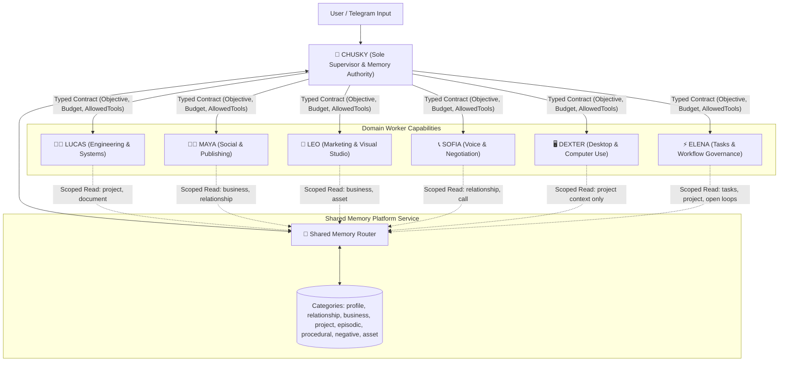

# Implementation Plan: Controlled Supervisor-Worker Architecture & Shared Memory Platform

## Executive Overview

This design implements a **Controlled Supervisor-Worker Architecture** for Chusky. Rather than spawning unconstrained conversational personalities that talk freely, Chusky functions as the **sole authority** for approvals, memory writes, external actions, and final user delivery. 

The 6 domain specialists (**Lucas**, **Maya**, **Leo**, **Sofia**, **Dexter**, **Elena**) act as **typed execution capabilities** invoked through strict delegation contracts with tool scoping, budget bounds, audit logs, and automatic fallback recovery.

In parallel, memory is managed as a **Shared Memory Platform Service (Memory Router)** with explicit category scoping, supersession tracking, vector similarity search, and strict retrieval filtering per capability.

---

## 1. Supervisor-Worker System Architecture



---

## 2. Typed Delegation Contracts & Control Protocol

Every task assigned by Chusky to a domain worker capability is bound by a strict TypeScript contract:

```ts
export interface DelegationContract {
  id: string;
  supervisor: "chusky";
  worker: "lucas" | "maya" | "leo" | "sofia" | "dexter" | "elena";
  objective: string;
  allowedTools: string[];
  context: Record<string, unknown>;
  expectedOutput: string;
  approvalPolicy: "auto" | "require_chusky_approval";
  timeoutSeconds: number;
  maxToolCalls: number;
}
```

### Execution Rules & Fallback Policy
1. **Tool Access**: The worker can ONLY invoke tools specified in `allowedTools`. Tool execution outside the contract is blocked instantly.
2. **Action Approvals**: Workers CANNOT perform direct public posts, phone calls, or file deletions. They prepare proposal payloads for Chusky, who validates and requests user approval when required.
3. **Fallback & Recovery**:
   - If a worker encounters an unhandled tool exception, it enters a 1-turn reflection loop with the error stack trace.
   - If a worker exceeds `maxToolCalls` or `timeoutSeconds`, the contract terminates cleanly and returns a `DELEGATION_FAILED` status to Chusky.
   - Chusky then either attempts a retry with modified contract parameters or executes a direct fallback.

---

## 3. Shared Memory Platform Service (Memory Router)

Memory is NOT an unrestricted sub-agent; it is a **unified platform service** governed by Chusky.

### A. Memory Record Schema
```ts
export type MemoryCategory = 
  | "profile"      // Preferences, timezone, writing style
  | "relationship" // People, companies, sensitivities, interaction history
  | "business"     // Company facts, brand rules, operating preferences
  | "project"      // Goals, decisions, deadlines, open loops
  | "episodic"     // Meaningful completed events
  | "procedural"   // Approved workflows and playbooks
  | "negative"     // Things Chusky must avoid (do-not rules)
  | "asset";       // References to saved images, logos, documents

export interface MemoryRecord {
  id: string;
  ownerId: number;
  category: MemoryCategory;
  key: string;
  value: string;
  source: string;
  confidence: number; // 0.0 - 1.0
  createdAt: number;
  updatedAt: number;
  expiresAt?: number;
  reviewAt?: number;
  status: "active" | "superseded" | "deleted";
  supersedesId?: string; // Tracks audit trail when facts evolve
}
```

### B. Core Memory Behaviors
1. **Explicit / Lasting State**: Saves memory ONLY when explicitly requested by the user or when a lasting fact is clearly stated.
2. **Pre-Save Classification**: Classifies memory into one of the 8 structured categories before persisting.
3. **Supersession & Audit**: When updating an existing fact, the old record status changes to `"superseded"` with `supersedesId` linking to the new active record—preventing duplicate clutter while preserving history.
4. **Explicit Deletion**: Full support for `forget` / `delete` by key or ID.
5. **Multi-Vector & Keyword Retrieval**: Query by category, owner, scope, keywords, recency, and vector similarity.
6. **Bounded Injection**: Injects ONLY top relevant memories (`topK: 5`) into current prompts. Never dumps the entire memory store.

### C. Capability-Scoped Memory Access Matrix

| Worker Capability | Allowed Read Categories | Memory Access Boundary |
|---|---|---|
| 👨‍💻 **Lucas** (Engineering) | `project`, `procedural`, `asset` | Technical specs, repo goals, document schemas |
| 👩‍💼 **Maya** (Social) | `business`, `relationship`, `procedural` | Brand facts, company connections, post playbooks |
| 🎨 **Leo** (Marketing) | `business`, `asset`, `profile` | Brand guidelines, saved logos/images, writing tone |
| 📞 **Sofia** (Voice) | `relationship`, `business` | Contact sensitivities, call histories, phone preferences |
| 🖥️ **Dexter** (Computer Use) | `project` | Specific UI task instructions; **no private user data** |
| ⚡ **Elena** (Task Operations) | `project`, `procedural`, `episodic` | Active tasks, open loops, completed milestones |
| 🐶 **Chusky** (Supervisor) | **ALL CATEGORIES** | Sole authority for cross-domain memory policy & writes |

---

## 4. Proposed File Architecture

### Delegation Engine
- **[NEW] [`src/subagents/contracts.ts`](file:///c:/Users/mseyy/Downloads/tg-agent/src/subagents/contracts.ts)**: Types and validation for `DelegationContract`, `DelegationResult`, and fallback policies.
- **[NEW] [`src/subagents/capabilities.ts`](file:///c:/Users/mseyy/Downloads/tg-agent/src/subagents/capabilities.ts)**: Manifests for Lucas, Maya, Leo, Sofia, Dexter, and Elena (tool whitelists, prompt templates, reflection rules).
- **[NEW] [`src/subagents/executor.ts`](file:///c:/Users/mseyy/Downloads/tg-agent/src/subagents/executor.ts)**: Executes worker capabilities under typed contracts with budget enforcement, timeouts, and fallback recovery.

### Memory Platform Service
- **[NEW] [`src/memory/types.ts`](file:///c:/Users/mseyy/Downloads/tg-agent/src/memory/types.ts)**: `MemoryRecord`, `MemoryCategory`, `SupersessionTrail`, and query schemas.
- **[NEW] [`src/memory/router.ts`](file:///c:/Users/mseyy/Downloads/tg-agent/src/memory/router.ts)**: Central Memory Router handling classification, supersession, vector search, expiry checks, and domain-scoped filtering.

---

## User Review Required

> [!IMPORTANT]
> **Key Architecture Decisions**:
> 1. **Supervisor Authority**: Chusky is the sole authority for approvals, memory writes, external delivery, and user communications.
> 2. **Controlled Capability Execution**: Domain specialists (Lucas, Maya, Leo, Sofia, Dexter, Elena) run as typed capabilities under strict contract limits (`maxToolCalls`, `timeout`, `allowedTools`).
> 3. **Shared Memory Platform**: Unified Memory Router with 8 categories, supersession tracking, and capability-scoped retrieval.

---

## Verification Plan

### Automated Tests
- `npm run typecheck` to verify contract types and memory schemas.
- Add `tests/delegation.test.ts`:
  - Test delegation contract enforcement (tool whitelist blocking, timeout, maxToolCalls limit).
  - Test fallback recovery when a worker returns an error.
- Add `tests/memory-router.test.ts`:
  - Test supersession logic (`status: "superseded"`).
  - Test category-scoped memory retrieval for each worker capability.

### Manual Verification
- Verify supervisor-worker execution via Chusky orchestrator tool calls.
